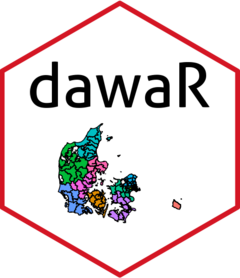

<!-- README.md is generated from README.Rmd. Please edit that file -->

```{r, include = FALSE}
knitr::opts_chunk$set(
  collapse = TRUE,
  comment = "#>",
  fig.path = "man/figures/README-",
  out.width = "100%",
  fig.width = 12,
  fig.height = 9
)
```

# dawaR <a href="http://dawar.aleksanderbl.dk/"></a>

<!-- badges: start -->
[](https://github.com/aleksanderbl29/dawaR/actions/workflows/R-CMD-check.yaml)
[](https://app.codecov.io/gh/aleksanderbl29/dawaR)
<!-- badges: end -->

The goal of dawaR is to make access to the Danish Web Address API convenient for many more users.

## TO DO before CRAN-submission

- [ ] Choose some often-used sections to create specific functions for
  - These will basically be wrappers for other functions in the package and will provide another level of convenience for non-technical users.

## Installation

```{r check_cran, include=FALSE}
if (!require(available)) install.packages("available")
is_on_cran <- !available::available_on_cran("dawaR")
```

```{r cran_instruct, echo=FALSE, results='asis', eval=is_on_cran}
cat("You can install `{dawaR}` from CRAN with:")
```

```{r cran_code, eval=FALSE, include=is_on_cran}
install.packages("dawaR")
```

You can install the development version of dawaR from [GitHub](https://github.com/) with:

``` r
# install.packages("devtools")
devtools::install_github("aleksanderbl29/dawaR")
```

If you install the package in an environment that is configured with [`renv`](https://rstudio.github.io/renv/index.html) on MacOS, please consult `vignette("renv-issues")` to ensure that `get_map_data()` works as intended.

## Usage

Be sure to see the [getting started](articles/dawaR.html) and the [guide on how to make maps with {dawaR}](articles//printing_maps.html).

## DAWA *will* be phased out

The government entity that maintains the Danish Web Address API has disclosed that the API will be phased out at some point. When that time comes, this package will become deprecated and I will have another package ready to provide the same functionality. The service that is to replace DAWA is called Datafordeleren (The Data Distribution) and is in the works. Some functionality in relation to The Central Register of Buildings (BBR) has already been moved to the new service.

If you know how to read danish (or use machine-translation) you can keep yourself up to date on [this page](https://dataforsyningen.dk/data/4924).

But no worries! It does not sound like the shutdown of DAWA will happen anytime soon or without due notice. You can read more about this and read the history of updates in `vignette("status")`.
