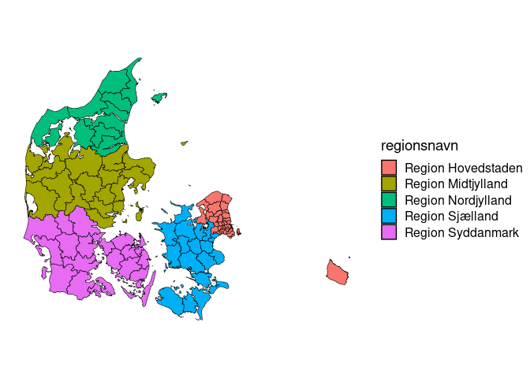

<!-- README.md is generated from README.Rmd. Please edit that file -->

# dawaR

<!-- badges: start -->

[](https://github.com/aleksanderbl29/dawaR/actions/workflows/R-CMD-check.yaml)
<!-- badges: end -->

The goal of dawaR is to …

## Installation

You can install the development version of dawaR from
[GitHub](https://github.com/) with:

``` r
# install.packages("pak")
pak::pak("aleksanderbl29/dawaR")
```

## Examples

This package has multiple use cases, though they all revolve around data
from the Danish Web Address API.

### Using DAWA map data

The function `get_map_data()` fetches data in `geojson` format and
transforms the geometries to `{sf}` polygons. These polygons can be
drawn as nice maps with `{ggplot2}`.

``` r
library(dawaR)
library(ggplot2)

municipalities <- get_map_data("kommuner")
ggplot(municipalities, aes(fill = regionsnavn)) +
  geom_sf(color = "black") +
  cowplot::theme_map()
```


