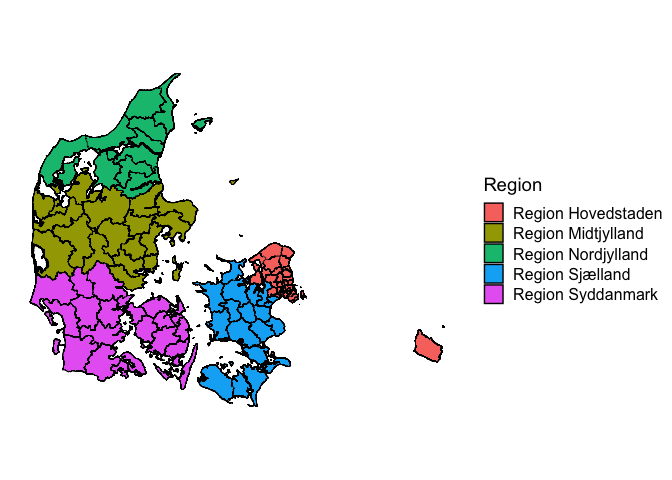

<!-- README.md is generated from README.Rmd. Please edit that file -->

# dawaR <a href="http://dawar.aleksanderbl.dk/"></a>

<!-- badges: start -->

[](https://github.com/aleksanderbl29/dawaR/actions/workflows/R-CMD-check.yaml)
[](https://app.codecov.io/gh/aleksanderbl29/dawaR)
<!-- badges: end -->

The goal of dawaR is to make access to the Danish Web Address API
convenient for many more users.

## TO DO before CRAN-submission

- [x] Tests should pass in CI as well as locally.
  - I used to have problems with a dependency that would convert the
    time column provided by `get_map_data()`. It is fixed with commit
    `23ade73`. *- I currently have an issue with the date-time column is
    converted to local time instead of UTC as is provided by the API.
    This causes differences between my local development machine and
    Github Actions.*
- [x] Write reverse lookup function to wrap in section functions
- [x] Write autocomplete function to wrap in section functions
- [ ] Choose some often-used sections to create specific functions for
  - These will basically be wrappers for other functions in the package
    and will provide another level of convenience for non-technical
    users.

## Installation

You can install the development version of dawaR from
[GitHub](https://github.com/) with:

``` r
# install.packages("devtools")
devtools::install_github("aleksanderbl29/dawaR")
```

To use the `get_map_data()` functions on MacOS you need to install the
`{sf}` package from source [following the official
instructions](https://github.com/r-spatial/sf?tab=readme-ov-file#macos).

## Examples

This package has multiple use cases, though they all revolve around data
from the Danish Web Address API. If the below examples are not enough,
please do read through the vignettes.

### Using DAWA to crosstab municipalities and their regions.

The function `get_data()` fetches the data in `json` format and by
default transforms it to a data.frame.

``` r
library(dawaR)
library(dplyr)

municipalities <- get_data("kommuner")

nordjylland <- municipalities |>
  dplyr::filter(regionsnavn == "Region Nordjylland") |>
  dplyr::pull(navn)

nordjylland
#>  [1] "Morsø"           "Thisted"         "Brønderslev"     "Frederikshavn"  
#>  [5] "Vesthimmerlands" "Læsø"            "Rebild"          "Mariagerfjord"  
#>  [9] "Jammerbugt"      "Aalborg"         "Hjørring"
```

Here we have extracted all the municipalities that are in “Region
Nordjylland”. The same can be done for voting precincts or police
regions. It can also be done for addresses and others. Look through the
available sections with `available_sections()`.

### Using DAWA map data

The function `get_map_data()` fetches data in `geojson` format and
transforms the geometries to `{sf}` polygons. These polygons can be
drawn as nice maps with `{ggplot2}`.

``` r
library(dawaR)
library(ggplot2)

municipalities <- get_map_data("kommuner")
ggplot(municipalities, aes(fill = regionsnavn)) +
  geom_sf(color = "black") +
  labs(fill = "Region") +
  cowplot::theme_map()
```



## DAWA *will* be phased out

The government entity that maintains the Danish Web Address API has
disclosed that the API will be phased out at some point. When that time
comes, this package will become deprecated and I will have another
package ready to provide the same functionality. The service that is to
replace DAWA is called Datafordeleren (The Data Distribution) and is in
the works. Some functionality in relation to The Central Register of
Buildings (BBR) has already been moved to the new service.

If you know how to read danish (or use machine-translation) you can keep
yourself up to date on [this
page](https://dataforsyningen.dk/data/4924).

But no worries! It does not sound like the shutdown of DAWA will happen
anytime soon or without due notice. You can read more about this and
read the history of updates in `vignette("status")`.
