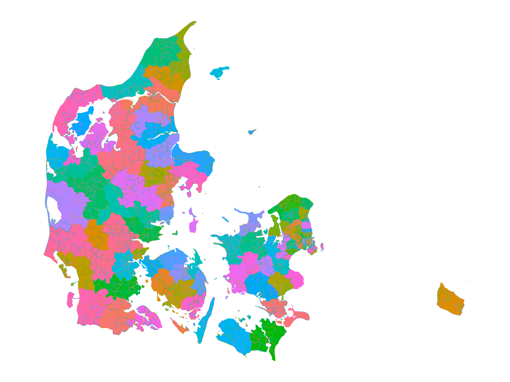

# Printing maps with dawaR and ggplot2

This article will show you how to use
[`get_map_data()`](https://dawar.aleksanderbl.dk/reference/get_map_data.md)
and [ggplot2](https://ggplot2.tidyverse.org) to draw nice looking maps
of Denmark.

First we need to load the packages. Here, we only load
[ggplot2](https://ggplot2.tidyverse.org) to minimize dependencies, but
you can definitely load the entire
[tidyverse](https://tidyverse.tidyverse.org) for convenience.

``` r
library(dawaR)
library(ggplot2)
```

## Getting map data

After loading the required packages we need to get the map data. We will
request map data for all (98) danish municipalities. The danish word for
*municipality* is *kommune* which is what we will request.

``` r
municipalities <- get_map_data("kommuner")
#> → Getting data on `kommuner`. This usually takes 13.13s.
#> Fetching data from the API. This will take some time.
#> Reading data to `st`.
#> Converting map data to `sf` object
```

In the dropdown below you can see the
[`head()`](https://rdrr.io/r/utils/head.html) of the data we have
received.

`head(municipalities)`

      #> Simple feature collection with 6 features and 11 fields
      #> Geometry type: MULTIPOLYGON
      #> Dimension:     XY
      #> Bounding box:  xmin: 12.2635 ymin: 55.53633 xmax: 12.73425 ymax: 55.77944
      #> Geodetic CRS:  WGS 84
      #>   dagi_id kode          navn regionskode udenforkommuneinddeling
      #> 1  389103 0101     København        1084                   FALSE
      #> 2  389104 0147 Frederiksberg        1084                   FALSE
      #> 3  389105 0151      Ballerup        1084                   FALSE
      #> 4  389106 0153       Brøndby        1084                   FALSE
      #> 5  389107 0155        Dragør        1084                   FALSE
      #> 6  389108 0157      Gentofte        1084                   FALSE
      #>          regionsnavn              ændret          geo_ændret geo_version
      #> 1 Region Hovedstaden 2025-12-16 22:02:01 2025-12-16 22:02:01          22
      #> 2 Region Hovedstaden 2024-01-16 22:03:35 2024-01-16 22:03:35           7
      #> 3 Region Hovedstaden 2025-05-14 21:02:41 2025-05-14 21:02:41           9
      #> 4 Region Hovedstaden 2024-01-10 22:10:55 2024-01-10 22:10:55           7
      #> 5 Region Hovedstaden 2023-03-24 22:28:38 2023-03-24 22:28:38           3
      #> 6 Region Hovedstaden 2024-10-04 21:02:54 2024-10-04 21:02:54           7
      #>   visueltcenter_x visueltcenter_y                       geometry
      #> 1        12.49391        55.70409 MULTIPOLYGON (((12.56767 55...
      #> 2        12.52373        55.67937 MULTIPOLYGON (((12.53735 55...
      #> 3        12.36852        55.72707 MULTIPOLYGON (((12.30407 55...
      #> 4        12.40438        55.64504 MULTIPOLYGON (((12.44279 55...
      #> 5        12.65023        55.59381 MULTIPOLYGON (((12.64513 55...
      #> 6        12.55072        55.75098 MULTIPOLYGON (((12.59175 55...

The data can then be passed to a
[`ggplot2::geom_sf()`](https://ggplot2.tidyverse.org/reference/ggsf.html)
to print the map. I have also specified that the fill color should be
based on the municipality name to make it a bit more colorful.

``` r
ggplot(municipalities, aes(fill = navn)) +
  geom_sf() +
  cowplot::theme_map() +
  theme(legend.position = "none")
```


## Drawing maps with many lines

The above example is not very resource intensive. Trying to plot all the
danish voting precincts on the other hand, is somewhat more intensive.
To ease the production of such maps, I will now demonstrate how easy it
is to simplify the lines (without loss of substantial quality) to faster
plot the map. We will use the
[`rmapshaper::ms_simplify()`](https://rdrr.io/pkg/rmapshaper/man/ms_simplify.html)
function to do this.

First we get the data with
[`get_map_data()`](https://dawar.aleksanderbl.dk/reference/get_map_data.md)
and provide the *afstemningsomraader* (voting areas) as the type.

``` r
voting <- get_map_data("afstemningsomraader")
#> → Getting data on `afstemningsomraader`. This usually takes 18.77s.
#> Fetching data from the API. This will take some time.
#> Reading data to `st`.
#> Converting map data to `sf` object
```

Then let’s quickly examine how many more polygons we now have to draw.

``` r
nrow(municipalities)
#> [1] 99
nrow(voting)
#> [1] 1315
```

I have printed the amount of polygons for the municipality level as well
as the voting precinct level.

To plot all these polygons takes a substantial amount of time - You can
either just trust me on that or try it out for yourself after finishing
this article!

To accommodate this larger number of polygons we will simplify the lines
that make up said polygons.

``` r
voting_simplified <- rmapshaper::ms_simplify(
  voting,
  keep = 0.01,
  keep_shapes = TRUE
)
```

After simplifying the data we can now plot it.

``` r
ggplot(voting_simplified, aes(fill = kommunenavn, color = navn)) +
  geom_sf() +
  cowplot::theme_map() +
  theme(legend.position = "none")
```



Here, I have colored the shapes based on the municipality and then
turned the lines of each shape to a different color based on the voting
precincts name.

## Overlaying multiple maps

If you would like to plot how different municipalities are distributed
in the police regions you can simply get the data for both maps and pass
them as their own dataset/geom combos in
[ggplot2](https://ggplot2.tidyverse.org).

``` r
police <- get_map_data("politikredse")
#> → Getting data on `politikredse`. This usually takes 14.14s.
#> Fetching data from the API. This will take some time.
#> Reading data to `st`.
#> Converting map data to `sf` object
# We will reuse the municipality data from earlier.
```

Then you can pass it to [ggplot2](https://ggplot2.tidyverse.org) as
follows.

``` r
ggplot() +
  geom_sf(
    data = police,
    aes(fill = navn),
    color = NA
  ) +
  geom_sf(
    data = municipalities,
    color = "black",
    fill = NA
  ) +
  cowplot::theme_map() +
  theme(legend.position = "none")
```


As you can see, we have now produced a map with shapes from different
subsections of Denmark.
